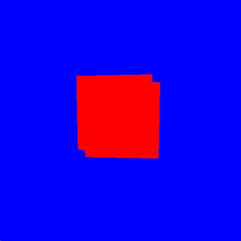

# game-engine

[Work-in-progress] [Not in current development]

Lightweight rendering framework with JSON serialization.

---

```json
{
	"Shaders": [
		{
			"id": 0,
			"vertexPath": "../../test/shaders/vert.vert",
			"fragmentPath": "../../test/shaders/frag.frag"
		}
	],

	"RenderLayers": [
		{
			"id": 0,
			"shaderId": 0,
			"cameraId": 0,
			"outputType": "2D"
		}
	],

	"Objects": [
		{
			"id": "UserClass",
			"renderLayerId": 0,
			"geometryPath": "",
			"position": [0.0, 0.0, 0.0],
			"rotation": [0.0, 0.0, 0.0]
		},
		{
			"id": "UserClass",
			"renderLayerId": 0,
			"geometryPath": "",
			"position": [0.1, 0.1, 0.0],
			"rotation": [0.0, 0.0, 0.0]
		}
	],

	"Cameras": [
		{
			"id": 0,
			"position": [0.0, 0.0, -1.0],
			"forward": [0.0, 0.0, 1.0]
		}
	]
}
```

```
APPLICATION CONSTRUCTED
{"forward":[0.0,0.0,1.0],"id":0,"position":[0.0,0.0,-1.0]}
CAMERA CONSTRUCTED
{"fragmentPath":"../../test/shaders/frag.frag","id":0,"vertexPath":"../../test/shaders/vert.vert"}
SHADER CONSTRUCTED
{"cameraId":0,"id":0,"outputType":"2D","shaderId":0}
{"geometryPath":"","id":"UserClass","position":[0.0,0.0,0.0],"renderLayerId":0,"rotation":[0.0,0.0,0.0]}
USER OBJECT CONSTRUCTED
{"geometryPath":"","id":"UserClass","position":[0.1,0.1,0.0],"renderLayerId":0,"rotation":[0.0,0.0,0.0]}
USER OBJECT CONSTRUCTED
```

